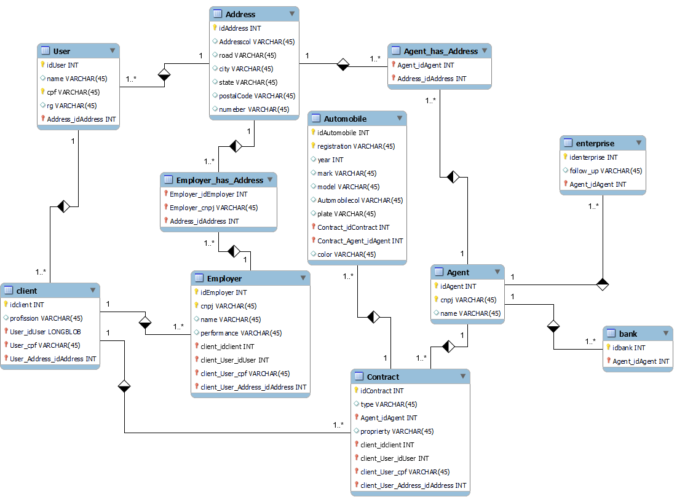

# Sistema de aluguel de carro

### Intregantes: Jhonatan Gutemberg Rosa Ferreira, Gabriel Henrique Miranda Rodrigues,André Cota Guimarães e Lívia Carolina de Souza Lima

Pretende-se desenvolver um sistema para apoio à gestão de aluguéis de automóveis que
permita efetuar, cancelar e modificar pedidos através da Internet. Após a análise inicial
de requisitos do sistema foram levantadas as seguintes informações:

## Descrição do Sistema:

O sistema só pode ser utilizado após cadastro prévio.
Os usuários individuais (clientes) podem introduzir, modificar, consultar e cancelar
pedidos de aluguel. Por outro lado, os agentes (empresas e bancos) podem modificar e
avaliar pedidos.
Após introdução no sistema, os pedidos são analisados do ponto de vista financeiro
pelos agentes e, em caso de parecer positivo, são colocados à sua consideração para
execução do contrato.
Sobre os contratantes do aluguel, armazenam-se os dados de identificação (RG, CPF,
Nome, Endereço), profissão, as entidades empregadoras e os respectivos rendimentos
auferidos (máximo 3).
Dependendo do tipo de contrato, os automóveis alugados podem ser registrados como
propriedade dos clientes, empresas ou bancos.
Sobre os automóveis, o sistema registra a matrícula, ano, marca, modelo e placa.
O aluguel de um automóvel pode estar associado com um contrato de crédito, o qual foi
concedido por um dos bancos agentes.
Em termos do sistema, o servidor central encontra-se ligado aos computadores locais
dos clientes e aos diversos agentes aderentes através da Internet.
O sistema pode ser subdividido em dois subsistemas: um para gestão de pedidos e
contratos; e outro para a construção dinâmica das páginas web.

## Diagrama de caso de uso:

## Diagrama de Classes: 

 ## Diagrama entidade relacionamento
 

 ## Diagrama de Classes: 
 

